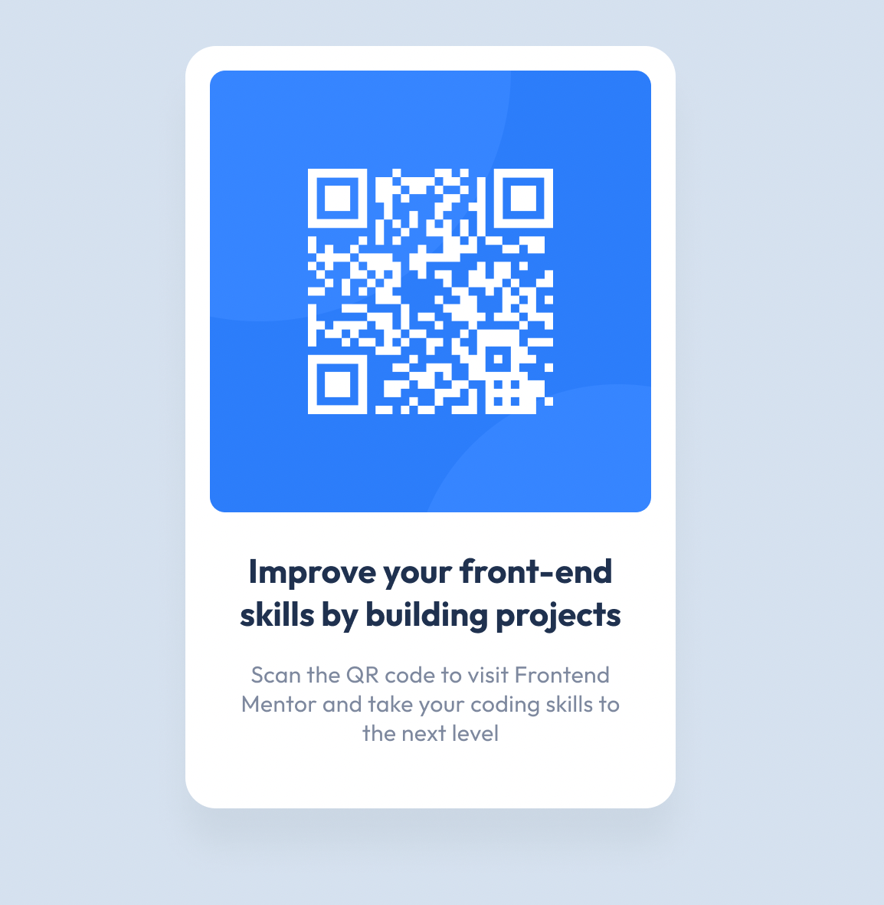

# Frontend Mentor - QR code component solution

This is a solution to the [QR code component challenge on Frontend Mentor](https://www.frontendmentor.io/challenges/qr-code-component-iux_sIO_H). Frontend Mentor challenges help you improve your coding skills by building realistic projects.

## Table of contents

- [Overview](#overview)
  - [Screenshot](#screenshot)
  - [Links](#links)
- [My process](#my-process)
  - [Built with](#built-with)
  - [What I learned](#what-i-learned)
  - [Useful resources](#useful-resources)
- [Author](#author)

## Overview

### Screenshot

### Links

- Solution URL: [Add solution URL here](https://your-solution-url.com)
- Live Site URL: [Add live site URL here](https://your-live-site-url.com)

## My process

### Built with

- Semantic HTML5 markup
- BEM methodology
- CSS custom properties
- Mobile-first workflow

### What I learned

I learned how to use the perfect pixel chrome extension to compare my result with the design.
I learned how to inspect a figma files for useful informations such as paddings and margin between elements.

### Useful resources

- [PerfectPixel chrome extension](https://chrome.google.com/webstore/detail/perfectpixel-by-welldonec/dkaagdgjmgdmbnecmcefdhjekcoceebi?hl=fr) - This helped me for XYZ reason. I really liked this pattern and will use it going forward.

## Author

- Website - [Gwenaël Magnenat](https://github.com/gmagnenat)
- Frontend Mentor - [@gmagnenat](https://www.frontendmentor.io/profile/gmagnenat)
- Twitter - [@magnenatg](https://www.twitter.com/magnenatg)
